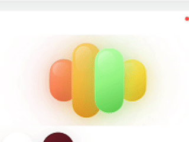

# RecordingSignalWave

A compact SwiftUI recording-wave component with four overlapping capsules, independent motion curves, and per-bar glow.

## Preview



## Features

- Four-capsule recording signal tuned for voice UI
- Independent bar motion so peaks do not rise in lockstep
- Per-capsule glow that intensifies while recording
- Built-in `default`, `compact`, and `hero` styles
- Pure SwiftUI, no assets and no dependencies
- Works on iOS, macOS, tvOS, and watchOS

## Installation

Add the package in Xcode or `Package.swift`:

```swift
.package(url: "https://github.com/ufukozendev/swiftui-recording-signal-wave.git", from: "1.0.0")
```

Then add the product to your target:

```swift
.product(name: "RecordingSignalWave", package: "swiftui-recording-signal-wave")
```

## Usage

```swift
import SwiftUI
import RecordingSignalWave

struct DemoView: View {
    @State private var audioLevel: Float = 0.72

    var body: some View {
        RecordingSignalWaveView(
            audioLevel: audioLevel,
            isRecording: true,
            style: .hero
        )
        .frame(width: 220, height: 150)
        .padding()
        .background(Color.black.opacity(0.92))
    }
}
```

## States

- `isRecording`: enables stronger motion and brighter glow
- `isPaused`: lowers motion into a softer idle state
- `isFinalizing`: keeps the component alive while transcript or upload work finishes

## Customization

Use a custom style:

```swift
let customStyle = RecordingSignalWaveView.Style(
    barWidth: 40,
    barSpacing: -10,
    maxBarHeight: 132,
    activeFrameRate: 36,
    reducedMotionFrameRate: 12,
    tones: [
        .init(
            top: .init(red: 0.98, green: 0.57, blue: 0.44),
            mid: .init(red: 0.92, green: 0.33, blue: 0.28),
            bottom: .init(red: 0.70, green: 0.18, blue: 0.18)
        ),
        .init(
            top: .init(red: 1.00, green: 0.82, blue: 0.42),
            mid: .init(red: 1.00, green: 0.72, blue: 0.24),
            bottom: .init(red: 0.86, green: 0.54, blue: 0.10)
        ),
        .init(
            top: .init(red: 0.74, green: 1.00, blue: 0.68),
            mid: .init(red: 0.58, green: 0.96, blue: 0.50),
            bottom: .init(red: 0.34, green: 0.78, blue: 0.28)
        ),
        .init(
            top: .init(red: 1.00, green: 0.94, blue: 0.48),
            mid: .init(red: 1.00, green: 0.86, blue: 0.24),
            bottom: .init(red: 0.86, green: 0.68, blue: 0.10)
        )
    ]
)
```

## Development

```bash
swift test
```

## License

MIT
